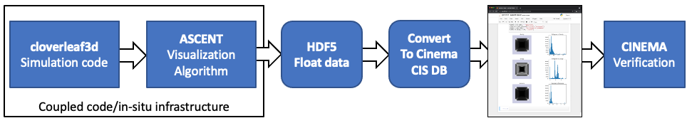
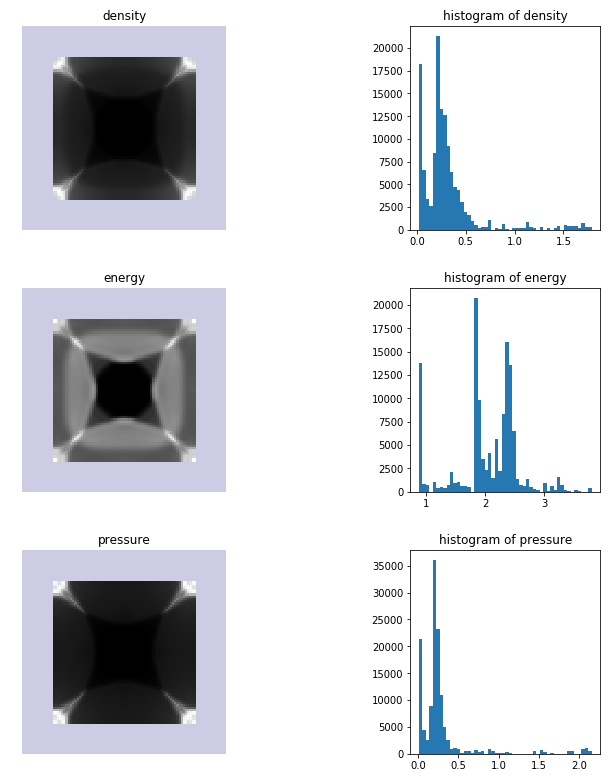

# Cinema Composable Image Set (CIS) example 

Diagram of workflow in this example.

This workflow exercises the Cinema Composable Image Set format ()[], using 
[Ascent's](https://ascent.readthedocs.io/en/latest/)
in-situ capabilities to extract data from a running simulation. The output 
is then stored in a Cinema database, in the CIS format,
and then viewed in a Cinema CIS viewer module in `jupyter notebook` (see below). 
The data format allows scientists to view and recolor images, and analyze the 
source data (from the simulation in unique ways).

The visualization below shows the results of viewing the data in jupyter notebook.
A scientist can compare images and related visualizations of the data using a set 
of components released as part of the `cinemasci` python module.

Images from the resulting Cinema database (used to validate run)

## Using this repository

The workflow does the following:

- Creates a [Pantheon](http://pantheonscience.org/) environment and build location
- Clones a specific commit of [Spack](https://github.com/spack/spack)
- Uses `spack` to build [Ascent](https://ascent.readthedocs.io/en/latest/) and set up a coupled app/in-situ workflow
- Runs the workflow to produce float images 
- Converts the output to a [Cinema CIS](https://cinemascience.org) database
- Adds a `Cinema` viewer and a jupyter notebook viewer, and packages up the results.
- Verifies the `Cinema` database

First, clone the repository, then:

1. edit the `bootstrap.env` file to include your compute allocation ID and workflow path.
2. `./execute` will execute the workflow

## Notes on this repository

A repository for examples using `Ascent`, in-situ creation of float data, converted to `Cinema CIS` databases, and verification. 

Build instructions embedded in this workflow are derived from the Ascent build instructions [here](https://ascent.readthedocs.io/en/latest/BuildingAscent.html). This workflow uses **spack** to build all executables, from a specific commit.

This workflow will pull cached builds from a [E4S](https://e4s-project.github.io/) repository, if they exist
to speed up the build/install of requisite applications. If no cached builds are available, it will use
[spack](https://github.com/spack/spack) to build applications.
